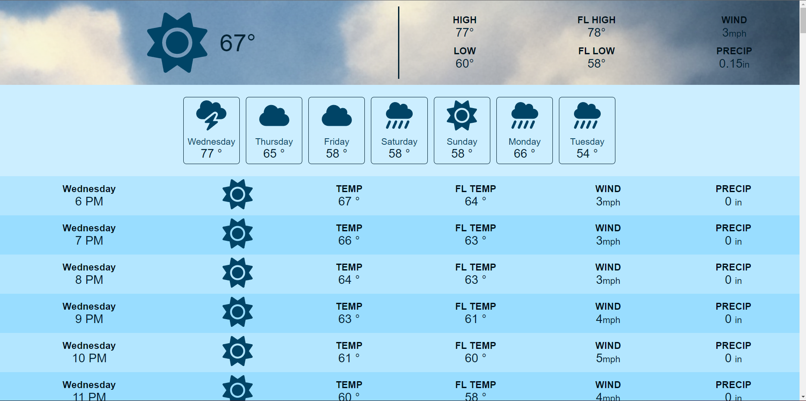

1. A brief description of the project: 
This Weather application is designed to furnish users with accurate and up-to-date weather information, including both current conditions and future forecasts. It comprises of a comprehensive data set including the current temperature, humidity, wind speed, precipitation, and a forecast for the next several days, as well as hourly weather information. The application operates independently of any external servers, utilizing Open-Meteo Weather APIs to retrieve data and provide forecast information. Furthermore, it employs the device's built-in sensors and GPS functionality to determine the current weather conditions and forecast.

2. Credit to the original source: https://www.youtube.com/watch?v=w0VEOghdMpQ

3. List of technologies used: HTML, CSS, JavaScript, Vite 

4. Setup instructions:
	Step 1: Clone the repository: Open a terminal and navigate to the directory where you want to store the project. Then, use the command git clone https://github.com/username/repository.git to clone the repository to your local machine.

	Step 2: Install dependencies: Navigate to the project's root directory and use the command npm install or yarn to install all the necessary dependencies.

	Step 3: Start the development server: Use the command npm run dev. It will automatically open a new browser or give you the local address so you can copy and paste to your browser.

	Step 4: Allow the browser to access your location so the app can work properly.

5. If there's any problem please contact this email: thanhban0210@gmail.com.

